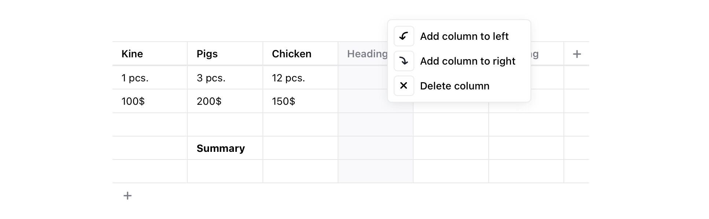

# List block tool for Editor.js

This is a clone of this [Editor.js nested-list block tool](https://github.com/editor-js/nested-list/). It fixes the ordered list issue.

## Preview



## Installation

**Using `npm`**

```sh
npm install @coolbytes/editorjs-list
```

**Using `yarn`**

```sh
yarn add @coolbytes/editorjs-list
```

## Usage

Include it in the `tools` property of Editor.js config:

```js
const editor = new EditorJS({
  tools: {
    list: List
  }
});
```

Or init the List tool with additional settings

```javascript
const editor = new EditorJS({
  tools: {
    list: {
      class: List,
      inlineToolbar: true,
      config: {
        defaultStyle: 'unordered'
      },
    },
  },
});
```

## Config Params

| Field        | Type     | Description                                                    |
|--------------|----------|----------------------------------------------------------------|
| defaultStyle | `string` | default list style: `ordered` or `unordered`, default is `unordered` |

## Output data

| Field | Type      | Description                              |
| ----- | --------- | ---------------------------------------- |
| style | `string`  | type of a list: `ordered` or `unordered` |
| items | `Item[]`  | the array of list's items                |

Object `Item`:

| Field   | Type      | Description               |
| ------- | --------- | ------------------------- |
| content | `string`  | item's string content     |
| items   | `Item[]`  | the array of list's items |


```json
{
    "type" : "list",
    "data" : {
        "style" : "unordered",
        "items" : [
            {
              "content": "Apples",
              "items": [
                {
                  "content": "Red",
                  "items": []
                },
                {
                  "content": "Green",
                  "items": []
                },
              ]
            },
            {
              "content": "Bananas",
              "items": [
                {
                  "content": "Yellow",
                  "items": []
                },
              ]
            },
        ]
    }
},
```